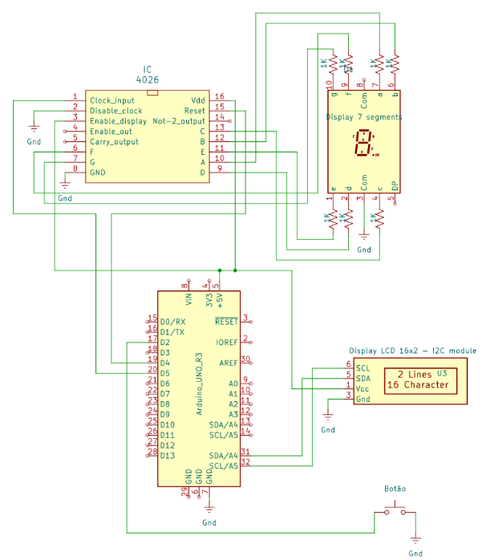
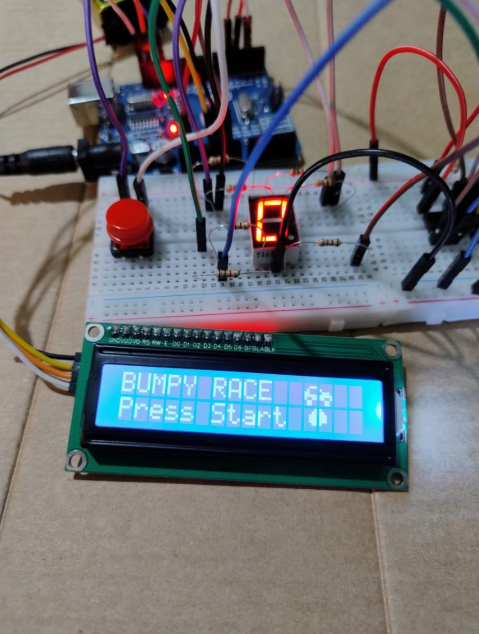
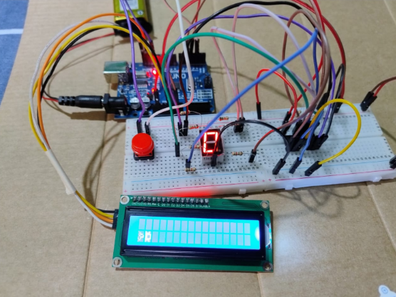
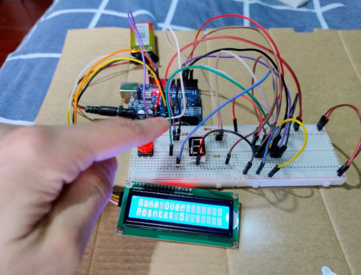

# Bumpy Race

Bumpy Race é um jogo interativo utilizando o Arduino e um display LCD de duas linhas. O jogo utiliza um botão para alternar a posição do carrinho entre as duas linhas do display LCD. Conforme o jogo avança, a velocidade do carrinho aumenta automaticamente, dificultando o controle do mesmo. A velocidade é exibida em forma de números de 1 a 9 em um display de 7 segmentos.

### Como jogar

1. Pressione o botão para iniciar o jogo. O carrinho começa na linha inferior do display.
2. Pressione o botão para alternar entre a linha superior e a linha inferior.
3. Buracos aparecem aleatoriamente e se movem da direita para a esquerda.
4. Se o carrinho colidir com um buraco, o jogo exibe "Game Over!" e reinicia automaticamente após um breve intervalo.
5. A cada 5 buracos desviados, a velocidade do jogo aumenta, reduzindo o intervalo entre as atualizações.

## Componentes

* Arduino UNO
* Display LCD 16x2, com módulo I2C soldado
* Display de 7 segmentos catodo comum
* CI CD4026BE (Decodificador para o display de 7 segmentos)
* Sete resistores de 1K Ohms
* Botão (Push button)
* Jumpers diversos
* Protoboard

## Caracteres especias do display

O display LCD possui 2 linhas com 16 espaços em cada uma para os caracteres aparecerem. Cada espaço desses possui 40 pontos ou pixels que podem ser acesos para formá-los. Uma vantagem é que pode-se criar caracteres personalizados, decidindo quais pixels devem acender. Foi utilizada uma ferramenta chamada “LCD Custom Character Generator” do site https://maxpromer.github.io/LCD-Character-Creator/ para isso.

## Código Fonte

O código do jogo está localizado no arquivo [script/bumpy_race.ino](script/bumpy_race.ino). Ele utiliza a biblioteca `LCDI2C_Multilingual` para controlar o display LCD. O código define sprites personalizados para o carrinho e os buracos, além de implementar a lógica do jogo, como movimentação, detecção de colisões e aumento de dificuldade.

### Principais Funções

- **`setup()`**: Configura o display LCD, registra os caracteres personalizados e inicializa as variáveis do jogo.
- **`loop()`**: Contém a lógica principal do jogo, incluindo a leitura do botão, movimentação dos buracos, exibição do carrinho e detecção de colisões.

## Esquema de montagem

## Fotos do projeto

